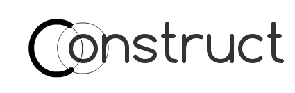

[notebook-fork]: https://github.com/hmc-cs111-fall2015/project-notebook/fork
[CS111-projects]: https://github.com/hmc-cs111-fall2015/hmc-cs111-fall2015.github.io/wiki/Project-links



# Runbook

To run the project do

```
sbt 'runMain construct.ConstructGREPL'
```

Then try

```
given point A, point B
let C1 = circle(A, B)
:s circle
let C2 = 0
:s intersection
let D, E = intersection(C1, C2)
let P = line(D, E)
let Q = segment(A, B)
let I = intersection(P, Q)
```

One can also use the whole-file processor with:

```
sbt 'runMain construct.ConstructC example.con'
```

# DSL projects

## Overview

For this project, you will design, implement, evaluate, and document
your own domain-specific language. This will be a significant effort on
your part, and the project makes up 40% of your grade in this course.
There will be periodic milestones during the rest of semester, to help keep you
on track and to provide you feedback as you work on your language.

Other than the deadlines and requirements described below, you have
complete freedom. In particular, you're free to choose the domain and
host language in which you will implement your DSL. You should choose a
domain that really interests you and for which having a DSL would
improve yours or others' programming productivity. I and other people in the
class can also provide guidance for designing / choosing a good project.

## Teamwork

You may work either by yourself or with one other person. In some circumstances,
you can work in larger teams, but talk to me first. Over time, I've discovered 
that it's best if the collaboration is driven by shared interest in a specific 
project, rather than by a general desire to work together on something.

Groups of projects will also act as teams. Each group will critique and provide 
feedback for the other projects in the group. I'll assign these groups after
everyone has settled on their project.

The entire class also acts as a team. Several times this semester, we'll work
together to critique and provide feedback on our projects.

## Milestones, Deliverables, and Deadlines

These are the due dates for the milestones and project materials. Details appear
after this section. The percentages next to each milestone is how much of the
total project each milestone is worth.

**Remember: there are no late days for project milestones. If work is
late, you will receive no credit.**

  - [Design notebook](#user-content-design-notebook) (10%) Every Sunday @ 11:59pm Pacific,
      starting Sunday, November 1.
  - [Critiques](#user-content-critiques) (10%) Every Tuesday @ 11:59pm Pacific,
      starting Tuesday, November 3.


  - [Project repositories](#user-content-repositories) Sunday, November 1 @ 11:59pm Pacific.
  - [Project description and plan](#user-content-project-description-and-plan) (5%) Sunday, November 1 @ 11:59pm Pacific.


  - [Language design and implementation overview](#user-content-language-design-and-implementation-overview) (10%) Sunday, 
    November 8 @ 11:59pm Pacific.


  - [Prototype](#user-content-prototype) (10%) Sunday, November 15 @ 11:59pm Pacific.


  - [Preliminary evaluation](#user-content-preliminary-evaluation) (10%) Sunday, November 22 @ 11:59pm Pacific.


  - [Demo / Presentation](#user-content-demo--presentation) (10%) Monday, December 7 / Wednesday, 
    December 9 @ 1:15pm Pacific.


  - [Final product](#user-content-final-product) (15%) Friday, December 11 @ 11:59pm
    Pacific.
  - [Final write-up](#user-content-final-write-up) (15%) Friday, December 11 @ 11:59pm
    Pacific.


## Design notebook 
*Every Sunday @ 11:59pm Pacific, starting Sunday, November 1. (10%)*

Everyone will keep an _individual_ design notebook. This notebook documents
your design process over the course of the project: important design decisions,
changes to previous decisions, open questions, exciting milestones, preliminary
results, etc. Feel free to include images (e.g., a sketch of the design or a
screenshot of a running program), links to code, and any other resources that
you think will help clearly convey your design process. 

The notebook also serves as a worklog, recording how much time you spent and how
much progress you made in a given week. The expectation is that each person will
spend at least nine hours a week on their project (including studio time).

The entry for each week should additionally address the following questions:

  - What is the most pressing issue for your project? What design decision do
    you need to make, what implementation issue are you trying to solve, or how
    are you evaluating your design and implementation?
  - What questions do you have for your critique partners? How can they best
    help you?
  - How much time did you spend on the project this week? If you're working in a
    team, how did you share the labor?

After the critique, you'll start your entry for the subsequent week 
with a summary and reflection of the critiques 
([see below](#critiques) for more details).

To get started, [fork the notebook][notebook-fork] to your personal repository.
Be sure to update the notebook each week before Sunday at 11:59pm and commit to
the repository. A thoughtful, clear entry each week is good for your project,
good for your grade, and provides excellent material for your critique partners
and your final deliverables.

## Critiques 
*Every Tuesday @ 11:59pm Pacific, starting Tuesday, November 3. (10%)*

### Your role as critic

Each week, each person will critique another project in their group. I will
often post critique prompts, and the project you're critiquing may also have
some questions they'd like your help with. 
_Note: We will often use Monday's class to get started on critiques._

Your job as a critic is to help make the project as good as it can be. Is there
a blind spot that the developer(s) missed? Do you know of a related language? Do
you know something about the domain? Can you think of good ways to evaluate the
language? Are the users of the language being served by the current design and
implementation?

Provide your critique in the appropriate file in the project's repository.

---

### Your role as project owner

Each week, you will also address the critiques of your own project. You should
include a *summary* and a *reflection* of the critiques. The summary provides a
high-level description of the feedback and help your critic(s) provided. The
reflection should answer questions such as:

   - How, specifically, did the feedback help improve the project?
   - Did the feedback point out or offer something you hadn't considered? Did it
     help you make a design decision? Was it helpful in addressing the most
     pressing issues in your project?
   - How will you incorporate the feedback into your work? Will you change
     something about the design, implementation, or evaluation as a result?

## Project repositories 
*Create these by Sunday, November 1 @ 11:59pm Pacific.*

Your project will be spread out over three repositories: "project", "notebook",
and "code". The sections below describe these repositories in more detail. Be
sure to have them all set up by the deadline.

### Project repository

This repository contains all the written deliverables, e.g., the milestones
and final report. It is a fork of the repository that contains this README
file. There will be one forked project repository for each project (i.e.,
each team that is working on a project). You've probably already forked this
repository. **Be sure to submit a pull request** by the Sunday deadline.

### Notebook repository

This repository contains your individual notebook. It is a [fork of a
provided repository][notebook-fork] that contains templates for your notebook
entries. **Be sure to do the following before the Sunday deadilne:**

   1. Fork the repository
   1. Write your first notebook entry
   1. Submit a pull request

### Code repository

This repository contains the implementation for your language. Each *project*
should have a GitHub repository that contains the project's code, documentation,
sample programs, etc. The code repository should always have an up-to-date
`README.md` file that describes how to run the sample programs in the DSL.

_Note: At first, you may not be able to execute programs in the DSL. In that case, the
`README.md` file can point people to example programs, or documentation, or
whatever you think will be most useful for your critique partners._

If you're working on a team, you might want to create a GitHub organization for 
the project and fork to that project. Alternatively, one of the team members can
volunteer their personal repository to host the project.

Be sure to invite all the team members, all your critique partners, and 
Prof. Ben to be members of your repository (so they can critique). You can 
invite others, too!

Consider enabling the Wiki (for documentation) and tickets.

Note that this repository is distinct from any repository related to CS 111,
in case you want to make your work publicly available but don't want it to be
tied to the CS 111's assignments.

**Before this Sunday's deadline**: 

   1. Create the repository, with an initial README
   1. Configure the repository so that all the appropriate people have access
   1. Add a link to your repository on the 
   [CS 111 wiki page for projects][CS111-projects]

## Project description and plan 
*Sunday, November 1 @ 11:59pm Pacific. (10%)*

This document is for you to collect and clearly convey the goals of your project
and to convey how you plan to design, implement, and evaluate your DSL.

Place your **project description** in the file `documents/description.md`. It
should address the following issues.

Motivation
  : Why is this project useful or interesting, what problem are you trying to
    address, and why is a DSL an appropriate solution?

Language domain
  : What is the domain that this language addresses, and why is the domain useful? 
    Who will benefit from this language? Are there any other DSLs for this 
    domain? If so, what are they, and how might they influence your language
    design and implementation?

Language design
  : If you had to capture your DSL's *design* in one sentence, what would it be?
    What constitutes a program in your language? What happens when a program
    runs? What kinds of input might a program take, and what kinds of output
    might it produce? Are there data or control structures that you know will be
    useful? What kinds of things might go wrong in a program in this domain 
    (e.g., syntax errors, compile-time errors, run-time errors)? How might you
    design your language to prevent such errors or to clearly communicate the
    results of errors to the user?

~ Begin Aside
You can describe the computations in the `description.md` file, or put them in 
separate files. Just be clear about where they are and what they mean.
~ End Aside

Example computations
  : Describe some example computations in your DSL. These computations should
    describe what happens when a specific program in your DSL executes. Note
    that you *shouldn't* describe the syntax of the program. Rather you should
    describe some canonical examples that help someone else understand the kinds
    of things that your DSL will eventually be able to do. 

Place your **project plan** in the file `documents/plan.md`. It should 
answer the following questions.

Language evaluation
  : How will you know that your language has accomplished its goals? What
    tools, techniques, or measurements will you use to evaluate your language
    *design*? What tools or practices will you use to ensure that your language
    *implementation* is of high quality?

Implementation plan
  : How much time do you think you'll need for the various components of your language 
    (e.g., finding a host language, implementing the semantics, the parser, 
    tools, etc)? Provide a brief schedule (e.g., with a deliverable every week) 
    for your project.

Teamwork plan
  : If you are working in a team, how do you plan to
    divide the labor? *Note: Each team member must work on every aspect
    of the project, including design, implementation, evaluation, and
    documentation.*


## Language design and implementation overview 

*Sunday, November 8 @ 11:59pm Pacific. (10%)*

This overview is a chance to reflect and get feedback on the important design
and implementation decisions you've made so far. 

Place your overview in the file `documents/design_and_implementation.md`. It
should address the following topics:

**Language design.** Give a high-level overview of your language. Be
sure to answer the following questions and *note any changes from your
original design*:

-   How does a user write programs in your language (e.g., do they type
    in commands, use a visual/graphical tool, speak, etc.)?
-   What is the basic computation that your language performs (i.e.,
    what is the computational model)?
-   What are the basic data structures in your DSL, if any? How does a the user
    create and manipulate data?
-   What are the basic control structures in your DSL, if any? How does the user
    specify or manipulate control flow?
-   What kind(s) of input does a program in your DSL require? What
    kind(s) of output does a program produce?
-   Error handling: How can programs go wrong, and how does your
    language communicate those errors to the user?
-   What tool support (e.g., error-checking, development environments)
    does your project provide?
-   Are there any other DSLs for this domain? If so, what are they, and
    how does your language compare to these other languages?

**Language implementation.** Give a high-level overview of the implementation
decisions you've made, including:

- Your choice of an internal vs. external implementation and how and why you
  made that choice.
- Your choice of a host language and how and why you made that choice. 
- Any significant syntax design decisions you've made and the reasons for those
  decisions.
- An overview of the architecture of your system.


## Prototype
*Sunday, November 15 @ 11:59pm Pacific. (10%)*

Have a preliminary version of your language by this time. The prototype can be
paper-based, in part or in full; although you should probably have a good
portion of code written by this point. We'll do critiques / code review of the 
prototypes in class this coming week.


## Preliminary evaluation 

*Sunday, November 22 @ 11:59pm Pacific. (10%)*

Provide some analysis of the work you've done so far. Place your evaluation in
the file `documents/evaluation.md`. Be sure to address the following issues:

-   What works well? What are you particularly pleased with?
-   What could be improved? For example, how could the user's experience
    be better? How might your implementation be simpler or more
    cohesive?
-   Re-visit your evaluation plan from the beginning of the project. Which tools
    have you used to evaluate the quality of your design? What have you learned
    from these evaluations? Have you made any significant changes as a result of
    these tools, the critiques, or user tests?
-   Where did you run into trouble and why? For example, did you come up
    with some syntax that you found difficult to implement, given your
    host language choice? Did you want to support multiple features, but
    you had trouble getting them to play well together?
-   What's left to accomplish before the end of the project?
-   If you worked as a pair, describe how you have divided your labor and
    whether that division has worked well.

## Demo / Presentation 

*Monday, December 7 / Wednesday & December 9 @ 1:15pm Pacific. (10%)*

This is your chance to show off by giving a demo of your DSL. 
In particular, we want to see:

1.  Your vision of a language in this domain. Why does the domain need a
    language, and what about your design is an interesting solution to problems
    in this language?
1.  Cool things that a programmer can do in your language (i.e., how are
    you easing domain experts' pain?). This is the "demo" part of the
    presentation: be sure to show us some example programs and their
    execution.
1.  Crafty techniques you used to implement your language (e.g., is
    there a set of simple semantic building blocks that you composed, or
    did you try something unexpected to overcome challenges in syntax
    design, environment design, etc.?)
1.  Interesting insights you had into language design and implementation
    (e.g., what did you think would be easy that wasn't, what did you
    think was difficult that wasn't, how would you advise other
    implementers of DSLs in your domain or otherwise, what would you do
    differently next time, what would you add/change if you had more
    time, etc.?).

*Note: The demo doesn't require that your implementation be 100% complete. You
can "fake" the demo to show us your vision, if your vision is too ambitious for
the project.*

## Final product 
*Friday, December 11 @ 11:59pm Pacific. (15%)*

Commit all the materials for your language, along with a few sample programs. Be
sure the `README.md` file describes how a user can run the sample programs in your
language. Test-drive this process to make sure that someone else can easily use
your DSL. Your code should follow good practices. In particular, it should be
well-architected (i.e., modular), well-tested, and well-documented.


## Final write-up 
*Friday, December 11 @ 11:59pm Pacific. (15%)*

Your write-up should describe your domain, your language, and your
design and implementation processes. Specifically, it should have the
following format:

_Note:_ Your writeup should be clear, cohesive, and well-written. A
list of bullets that addresses the following questions is not
sufficient.

**Introduction:** Describe your domain and motivate the need for a DSL
(i.e., how could domain-experts use and benefit from a DSL?). What is the
essence of your language, and why is it a good language for this domain?

_Note: Your project description can serve as a good first draft 
of the introduction._


**Language design details:** Give a high-level overview of your language's
design. Be sure to answer the following questions:

-   How does a user write programs in your language (e.g., do they type
    in commands, use a visual/graphical tool, speak, etc.)?
-   How does the syntax of your language help users write programmers
    more easily than the syntax of a general-purpose language?
-   What is the basic computation that your language performs (i.e.,
    what is the computational model)?
-   What are the basic data structures in your DSL, if any? How does a the user
    create and manipulate data?
-   What are the basic control structures in your DSL, if any? How does the user
    specify or manipulate control flow?
-   What kind(s) of input does a program in your DSL require? What
    kind(s) of output does a program produce?
-   Error handling: How can programs go wrong, and how does your
    language communicate those errors to the user?
-   What tool support (e.g., error-checking, development environments)
    does your project provide?
-   Are there any other DSLs for this domain? If so, what are they, and
    how does your language compare to these other languages?

_Note:_ Your language design overview can serve as a good first draft of the
language design details section.


**Example program(s):** Provide one or more examples that give the
casual reader a good sense of your language. Include inputs and outputs.
Think of this section as "Tutorial By Example". You might combine this section
with the previous one, i.e., use examples to help describe your language.

**Language implementation:** Describe your implementation. In
particular, answer the following questions:

-   What host language did you use (i.e., in what language did you
    implement your DSL)? Why did you choose this host language (i.e.,
    why is it well-suited for your language design)?
-   Is yours an external or an internal DSL (or some combination thereof)? Why
    is that the right design?
-   Provide an overview of the architecture of your language: front, middle, and
    back-end, along with any technologies used to implement these components.
-   "Parsing": How does your DSL take a user program and turn it into
    something that can be executed? How do the data and control
    structures of your DSL connect to the underlying semantic model?
-   Intermediate representation: What data structure(s) in the host language do
    you use to represent a program in your DSL?
-   Execution: How did you implement the computational model? Describe
    the structure of your code and any special programming techniques
    you used to implement your language. In particular, how do the
    semantics of your host language differ from the semantics of your
    DSL?


_Note: Your language implementation overview can serve as a good first draft of
language implementation section._

**Evaluation:** Provide some analysis of the work you did. In
particular:

-   How "DSL-y" is your language? How close or far away is it from a general-
    purpose language?
-   What works well in your language? What are you particularly pleased with?
-   What could be improved? For example, how could the user's experience
    be better? How might your implementation be simpler or more
    cohesive? Are there more features you'd like to have? Does your current
    implementation differ from your larger vision for the language?
-   Re-visit your evaluation plan from the beginning of the project. Which tools
    have you used to evaluate the quality of your design? What have you learned
    from these evaluations? Have you made any significant changes as a result of
    these tools, the critiques, or user tests?
-   Where did you run into trouble and why? For example, did you come up
    with some syntax that you found difficult to implement, given your
    host language choice? Did you want to support multiple features, but
    you had trouble getting them to play well together?
-   If you worked as a pair, describe how you have divided your labor and
    whether that division has worked well.

_Note: Your preliminary evaluation can serve as a good first draft of the 
evaluation section_


Place your writeup in the file `documents/final.md`.

